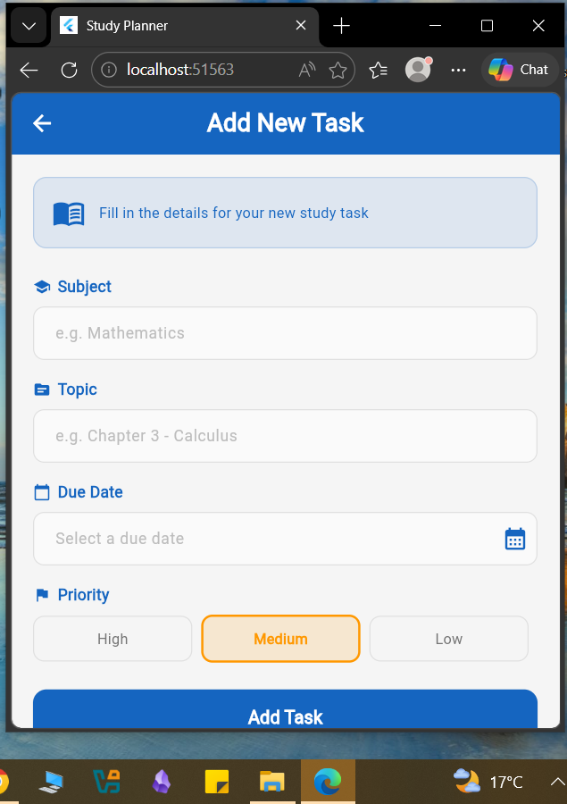
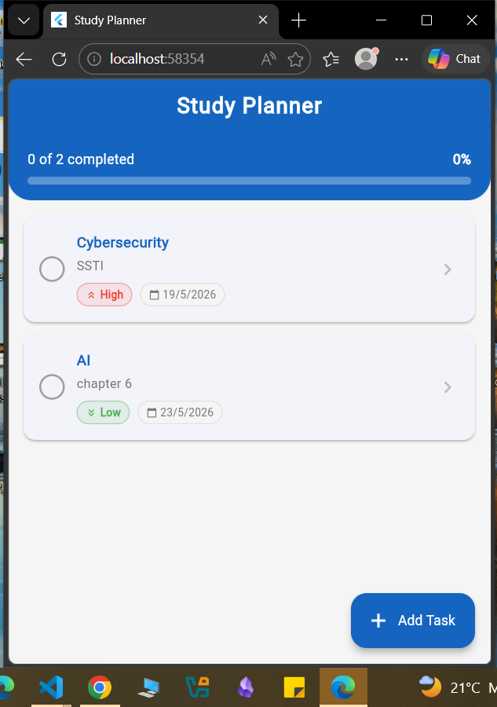
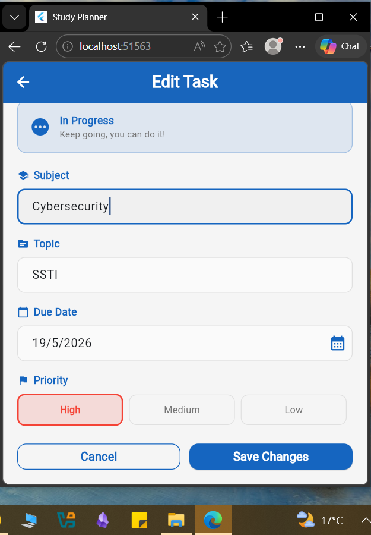
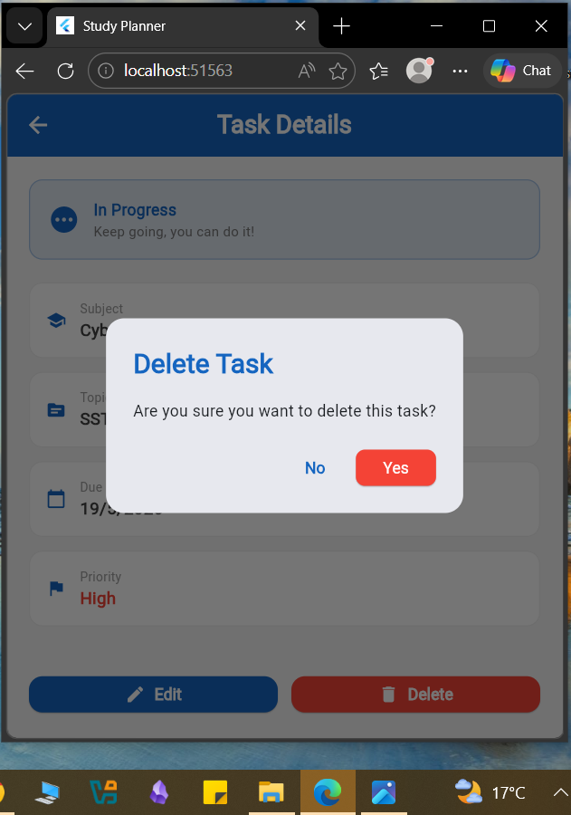
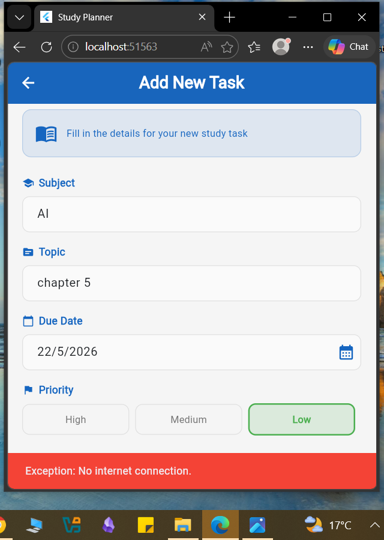
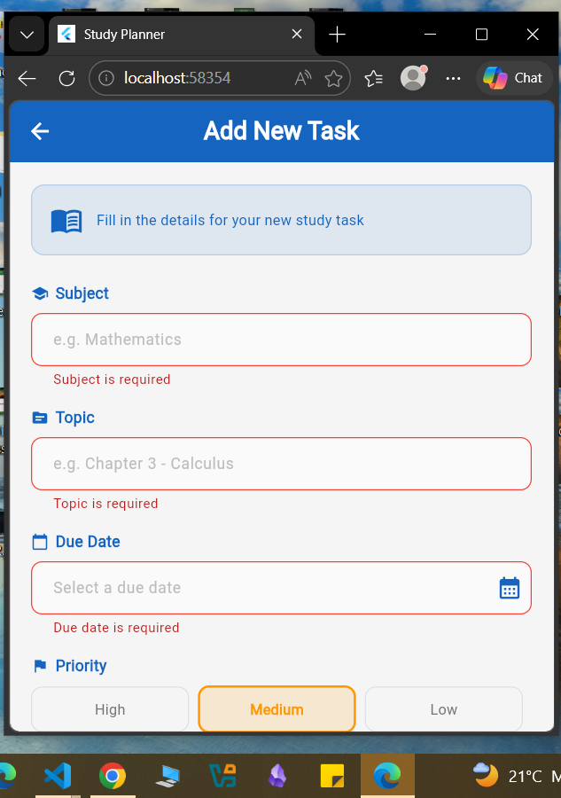
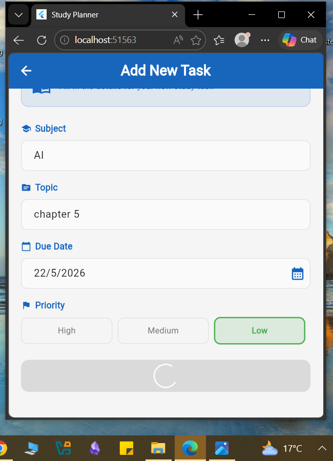

# Study Planner App

A flutter mobile application that helps students manage and track their study tasks using full CRUD operations.

## Features

**Create** : Add a new study task with subject, topic, priority and due date.

**Read** : View all study tasks in a clean card based home screen.

**Update** : Edit any existing study task.

**Delete** : Remove a task with a confirmation dialog.

**Toggle** : mard tasks as complete or incomplete.

**Progress** : track completion progress with a progress bar.

## Error Handling

-Network error message with retry button

-Form validation on all input fields

-Empty statewhen no task exist
-SUccess and failure snackbars for all actions

## Loading states

-Loading spinner while fetching data
-Loading spinner on submit buttons

-This app uses [JSONPlaceholder](https://jsonplaceholder.typicode.com)
as the public REST API.
-It used the latest Bloc state management solution for state management and the dio package for making network requests.